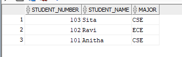
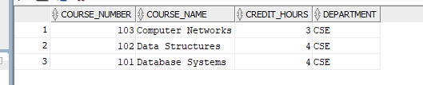
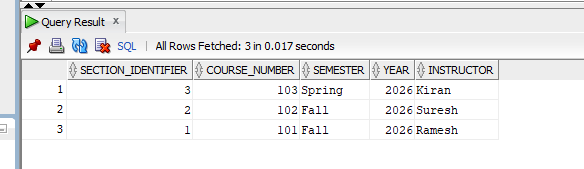
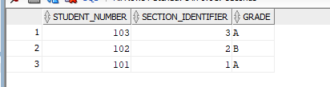
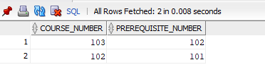

# (1a) 1. Create tables of the above database without constraints
```
CREATE TABLE STUDENT (
    Name VARCHAR2(20),
    Student_number NUMBER,
    Class NUMBER,
    Major VARCHAR2(10)
);

CREATE TABLE COURSE (
    Course_name VARCHAR2(30),
    Course_number VARCHAR2(10),
    Credit_hours NUMBER,
    Department VARCHAR2(10)
);

CREATE TABLE SECTION (
    Section_identifier NUMBER,
    Course_number VARCHAR2(10),
    Semester VARCHAR2(10),
    Year NUMBER,
    Instructor VARCHAR2(20)
);

CREATE TABLE GRADE_REPORT (
    Student_number NUMBER,
    Section_identifier NUMBER,
    Grade VARCHAR2(20)
);
```

# (1a) 2.Insert all values inside the table.
```
INSERT INTO STUDENT VALUES ('Smith', 17, 1, 'CS');
INSERT INTO STUDENT VALUES ('Brown', 8, 2, 'CS');

INSERT INTO COURSE VALUES ('Intro to Computer Science', 'CS1310', 4, 'CS');
INSERT INTO COURSE VALUES ('Data Structures', 'CS3320', 4, 'CS');
INSERT INTO COURSE VALUES ('Discrete Mathematics', 'MATH2410', 3, 'MATH');
INSERT INTO COURSE VALUES ('Database', 'CS3380', 3, 'CS');

INSERT INTO SECTION VALUES (85, 'MATH2410', 'Fall', 07, 'King');
INSERT INTO SECTION VALUES (92, 'CS1310', 'Fall', 07, 'Anderson');
INSERT INTO SECTION VALUES (102, 'CS3320', 'Spring', 08, 'Knuth');
INSERT INTO SECTION VALUES (112, 'MATH2410', 'Fall', 08, 'Chang');
INSERT INTO SECTION VALUES (119, 'CS1310', 'Fall', 08, 'Anderson');
INSERT INTO SECTION VALUES (135, 'CS3380', 'Fall', 08, 'Stone');

INSERT INTO GRADE_REPORT VALUES (17, 112, 'B');
INSERT INTO GRADE_REPORT VALUES (17, 119, 'C');
INSERT INTO GRADE_REPORT VALUES (8, 85, 'A');
INSERT INTO GRADE_REPORT VALUES (8, 92, 'A');
INSERT INTO GRADE_REPORT VALUES (8, 102, 'B');
INSERT INTO GRADE_REPORT VALUES (8, 135, 'A');
```

# (1a) 3.Describe all tables.
```
DESC STUDENT;

DESC COURSE;

DESC SECTION;

DESC GRADE_REPORT;
```

# (1a) 4.List all the tables.
```
SELECT * FROM tab;
```

# (1a) 5.Display the values of each table.
```
SELECT * FROM STUDENT;

SELECT * FROM COURSE;

SELECT * FROM SECTION;

SELECT * FROM GRADE_REPORT;
```

# (1a) 6.Delete all tables.
```
DROP TABLE STUDENT;

DROP TABLE COURSE;

DROP TABLE SECTION;

DROP TABLE GRADE_REPORT;
```

# (1b) 1. Implement the table using above constraints.
```
CREATE TABLE STUDENT (
    Name VARCHAR2(20),
    Student_number NUMBER PRIMARY KEY,
    Class NUMBER,
    Major VARCHAR2(10) NOT NULL
);
CREATE TABLE COURSE (
    Course_name VARCHAR2(30),
    Course_number VARCHAR2(10) PRIMARY KEY,
    Credit_hours NUMBER NOT NULL,
    Department VARCHAR2(10)
);
CREATE TABLE SECTION (
    Section_identifier NUMBER PRIMARY KEY,
    Course_number VARCHAR2(10),
    Semester VARCHAR2(10) NOT NULL,
    Year NUMBER,
    Instructor VARCHAR2(20)
);
CREATE TABLE GRADE_REPORT (
    Student_number NUMBER,
    Section_identifier NUMBER,
    Grade VARCHAR2(2) NOT NULL,
    PRIMARY KEY (Student_number, Section_identifier),
    FOREIGN KEY (Student_number) REFERENCES STUDENT(Student_number),
    FOREIGN KEY (Section_identifier) REFERENCES SECTION(Section_identifier)
);
CREATE TABLE PREREQUISITES (
    Course_number VARCHAR2(10),
    Prerequisite_number VARCHAR2(10),
    PRIMARY KEY (Course_number, Prerequisite_number),
    FOREIGN KEY (Course_number) REFERENCES COURSE(Course_number)
);
```

# (1b) 2.Display the discription of each table.
```
DESC STUDENT;
DESC COURSE;
DESC SECTION;
DESC GRADE_REPORT;
DESC PREREQUISITES;
```

# (1b) 3.Insert the values specified by the above database.
```
INSERT INTO STUDENT VALUES ('Smith',17,1,'CS');
INSERT INTO STUDENT VALUES ('Brown',8,2,

INSERT INTO COURSE VALUES ('Intro to Computer Science','CS1310',4,'CS');
INSERT INTO COURSE VALUES ('Data Structures','CS3320',4,'CS');
INSERT INTO COURSE VALUES ('Discrete Mathematics','MATH2410',3,'MATH');
INSERT INTO COURSE VALUES ('Database','CS3380',3,'CS');

INSERT INTO SECTION VALUES (85,'MATH2410','Fall',7,'King');
INSERT INTO SECTION VALUES (92,'CS1310','Fall',7,'Anderson');
INSERT INTO SECTION VALUES (102,'CS3320','Spring',8,'Knuth');
INSERT INTO SECTION VALUES (112,'MATH2410','Fall',8,'Anderson');
INSERT INTO SECTION VALUES (119,'CS1310','Fall',8,'Anderson');
INSERT INTO SECTION VALUES (135,'CS3380','Fall',8,'Stone');

INSERT INTO GRADE_REPORT VALUES (17,112,'B');
INSERT INTO GRADE_REPORT VALUES (17,119,'C');
INSERT INTO GRADE_REPORT VALUES (8,85,'A');
INSERT INTO GRADE_REPORT VALUES (8,92,'A');
```


# (1b) 4.Display the insatnces of each table in the database.
```
SELECT * FROM STUDENT;
SELECT * FROM COURSE;
SELECT * FROM SECTION;
SELECT * FROM GRADE_REPORT;
SELECT * FROM PREREQUISITES;
```





# (1b) 5.All dranch attribute in student table and describe the table.

```
ALTER TABLE STUDENT
ADD BRANCH VARCHAR2(10);

DESC STUDENT;
```

# (1b) 6.Copy major attribute values into branch attribute and display it.
```
UPDATE STUDENT
SET BRANCH = MAJOR;

SELECT BRANCH FROM STUDENT;
```

# (1b) 7.Remove the major attribute in student.
```
ALTER TABLE STUDENT
DROP COLUMN MAJOR;
```

# (1b) 8.Change the name of Course_number to cid in course and describe it.
```
ALTER TABLE COURSE
RENAME COLUMN COURSE_NUMBER TO CID;

DESC COURSE;
```

# (1b) 9.Change the value of credit-hrs of database to 4 in course
```
UPDATE COURSE
SET CREDIT_HOURS = 4
WHERE COURSE_NAME = 'Database';
SELECT * FROM COURSE;
```

# (1b) 10.Put NOT NULL consrtaint to column branch in student
```
ALTER TABLE STUDENT
MODIFY BRANCH VARCHAR2(10) NOT NULL;
```

# (1b) 11.Replace the student table name to pupil

```
RENAME STUDENT TO PUPIL;
DESC PUPIL;
```

# (1b) 12.Remove the student table
```
DROP TABLE PUPIL;
```

# (1b) 13.Remove the rows of 'Fall' Semester in section
```
DELETE FROM SECTION
WHERE SEMESTER = 'Fall';
```

# (1b) 14.Remove the row of 'Data_Structure' in Course
```
DELETE FROM COURSE
WHERE COURSE_NAME = 'Data Structures';
```

# (1b) 15.Remove all rows in all table using Truncate table
```
TRUNCATE TABLE GRADE_REPORT;
TRUNCATE TABLE PREREQUISITES;
TRUNCATE TABLE SECTION;
TRUNCATE TABLE COURSE;
TRUNCATE TABLE PUPIL;
```

# (1b) 16.Remove pupil course and section table so that it exsit in recycle binDROP TABLE PUPIL;
```
DROP TABLE COURSE;
DROP TABLE SECTION;
SHOW RECYCLEBIN;
```

# (1b) 17.Remove GRADE_REPORT and Prerequisites table permanently
```
DROP TABLE GRADE_REPORT PURGE;
DROP TABLE PREREQUISITES PURGE;
```

