# (10) 1.Create the employee table
```
CREATE TABLE employee (
    employee_id   NUMBER(6) PRIMARY KEY,
    employee_name VARCHAR2(50),
    department    VARCHAR2(30),
    salary        NUMBER(10,2)
);
```
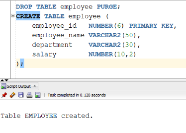

# (10) 2.Insert into sample employee records
```
INSERT INTO employee VALUES (1001, 'Ravi',   'CSE', 30000);
INSERT INTO employee VALUES (1002, 'Sita',   'ECE', 35000);
INSERT INTO employee VALUES (1003, 'Kiran',  'EEE', 40000);
INSERT INTO employee VALUES (1004, 'Anjali', 'CSE', 45000);
INSERT INTO employee VALUES (1005, 'Rahul',  'ECE', 38000);
INSERT INTO employee VALUES (1006, 'Priya',  'CSE', 50000);
INSERT INTO employee VALUES (1007, 'Arun',   'EEE', 42000);
INSERT INTO employee VALUES (1008, 'Sneha',  'CSE', 48000);
INSERT INTO employee VALUES (1009, 'Vijay',  'ECE', 36000);
INSERT INTO employee VALUES (1010, 'Divya',  'CSE', 52000);

COMMIT;
```
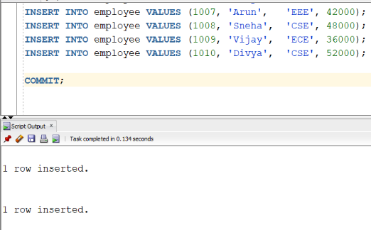

# (10) 3.Verify the employee
```
SELECT * FROM employee;
```
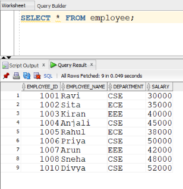

# (10) 4.Execute search query without an index
```
SELECT *
FROM employee
WHERE employee_name = 'Ravi';
```
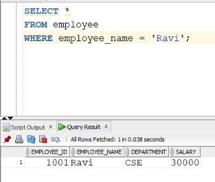

# (10) 5.Display the execution plan
```
EXPLAIN PLAN FOR
SELECT *
FROM employee
WHERE employee_name = 'Ravi';

SELECT *
FROM TABLE(DBMS_XPLAN.DISPLAY);
```
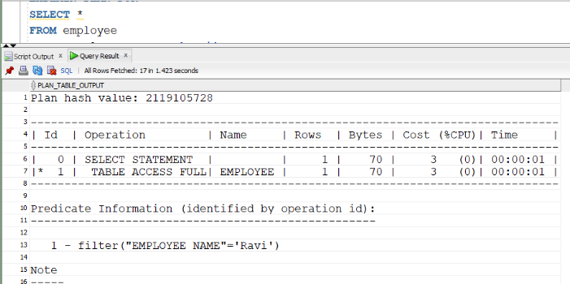

# (10) 6.Create an index on the search column
```
CREATE INDEX idx_employee_name
ON employee(employee_name);
```
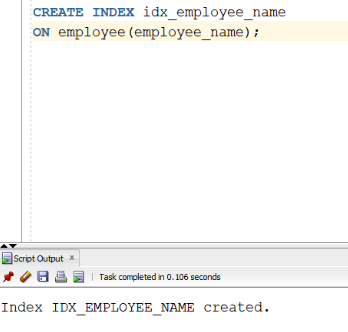

# (10) 7.Execute the same query again
```
SELECT *
FROM employee
WHERE employee_name = 'Ravi';
```
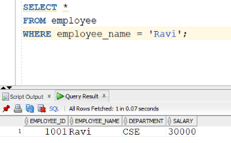
# (10) 8.Gather table statistics
```
BEGIN
    DBMS_STATS.GATHER_TABLE_STATS(
        USER,
        'EMPLOYEE'
    );
END;
/
```
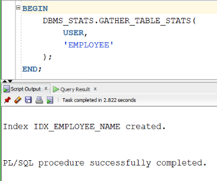
# (10) 9.Now generate the execution plan again
```
EXPLAIN PLAN FOR
SELECT *
FROM employee
WHERE employee_name = 'Ravi';

SELECT *
FROM TABLE(DBMS_XPLAN.DISPLAY);
```
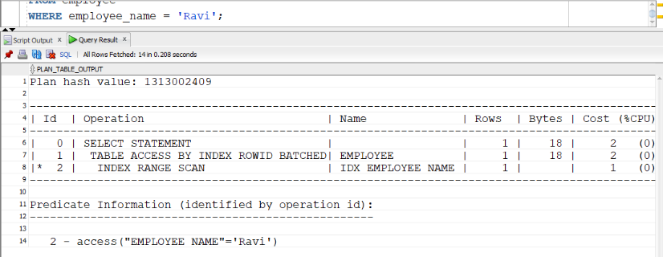
# (10) 10.Drop the created index
```
DROP INDEX idx_employee_name;
```
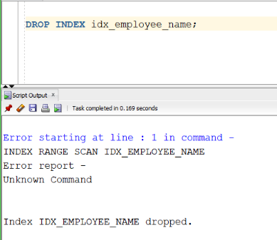
# (10) 11.Verify the index has been removed
```
SELECT index_name
FROM user_indexes
WHERE index_name = 'IDX_EMPLOYEE_NAME';
```
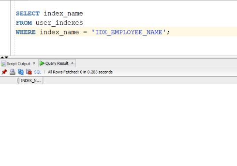
