# (2b) 1. Find the names and ages of all sailors
```
SELECT sname,age
FROM Sailors;
```
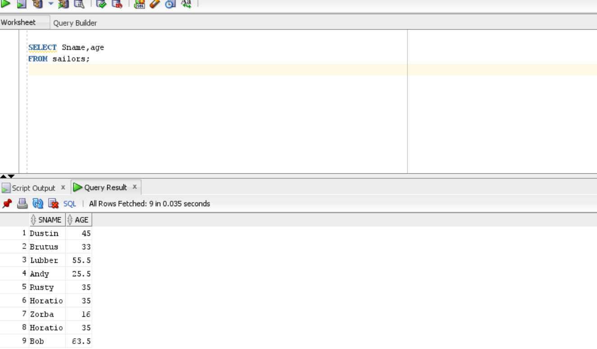
# (2b) 2. Find all sailors with a rating above 7.
```
SELECT * FROM Sailors
WHERE rating > 7;
```
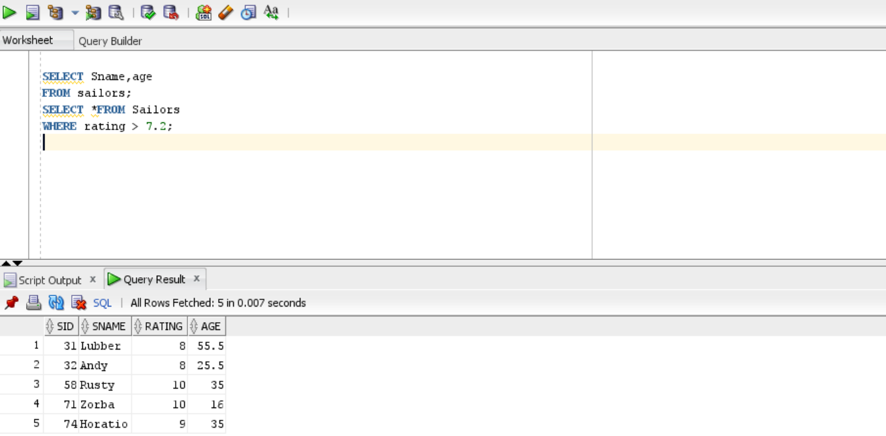
# (2b) 3. Find the names who have reserved boat number 103
```
SELECT s.sname
FROM Sailors s, Reserves r
WHERE s.sid = r.sid
AND r.bid = 103;
```
# (2b) 4. Find the sids of sailors who have reserved a red boat.
```
SELECT s.sid
FROM Sailors s, Reserves r, Boats b
WHERE s.sid = r.sid
AND r.bid = b.bid
AND b.color = 'red';
```
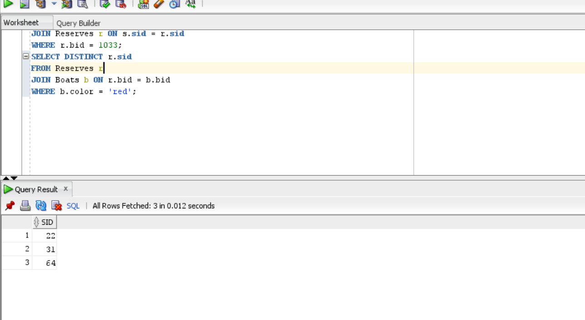
# (2b) 5. Find the names of sailors who have reserved a red boat.
```
SELECT s.sname
FROM Sailors s, Reserves r, Boats b
WHERE s.sid = r.sid
AND r.bid = b.bid
AND b.color = 'red';
```
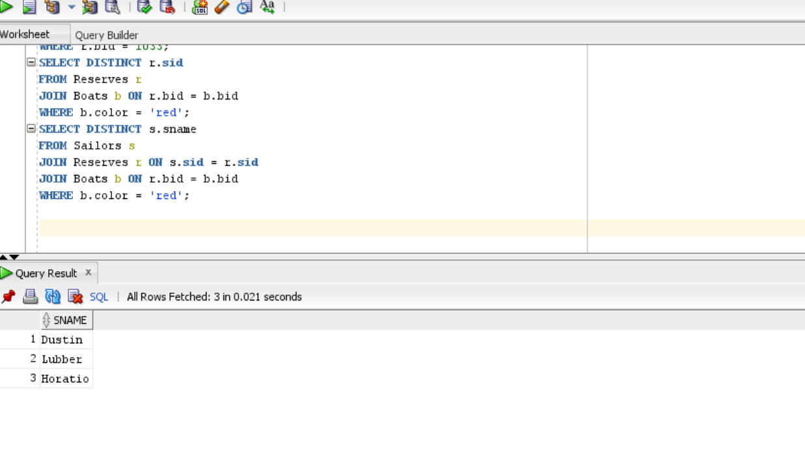
# (2b) 6. Find the colors of reserved by lubber.
```
SELECT b.color
FROM Sailors s, Reserves r, Boats b
WHERE s.sid = r.sid
AND r.bid = b.bid
AND s.sname = 'Lubber';
```
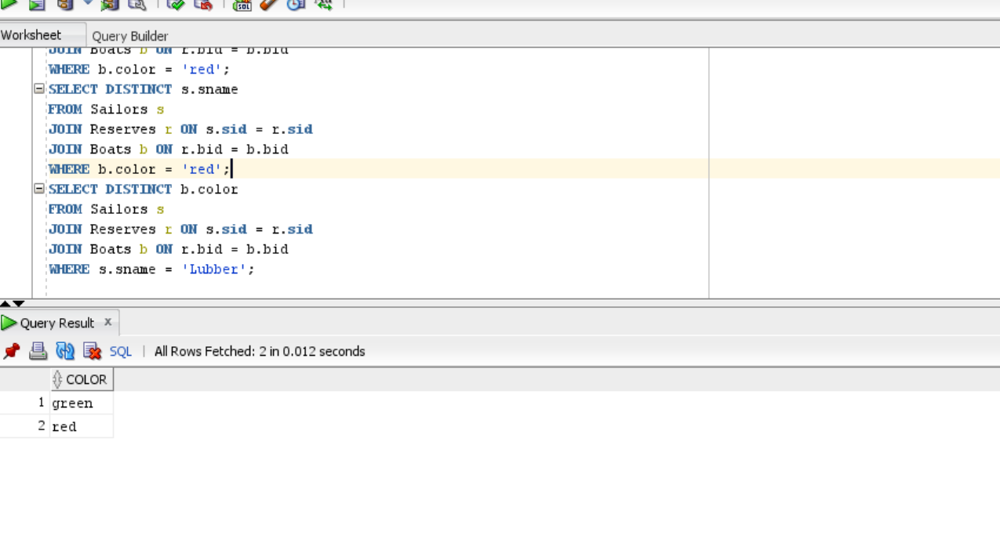
# (2b) 7. Find the names of sailors who have reserved at least one boat.
```
SELECT DISTINCT s.sname
FROM Sailors s, Reserves r
WHERE s.sid = r.sid;
```
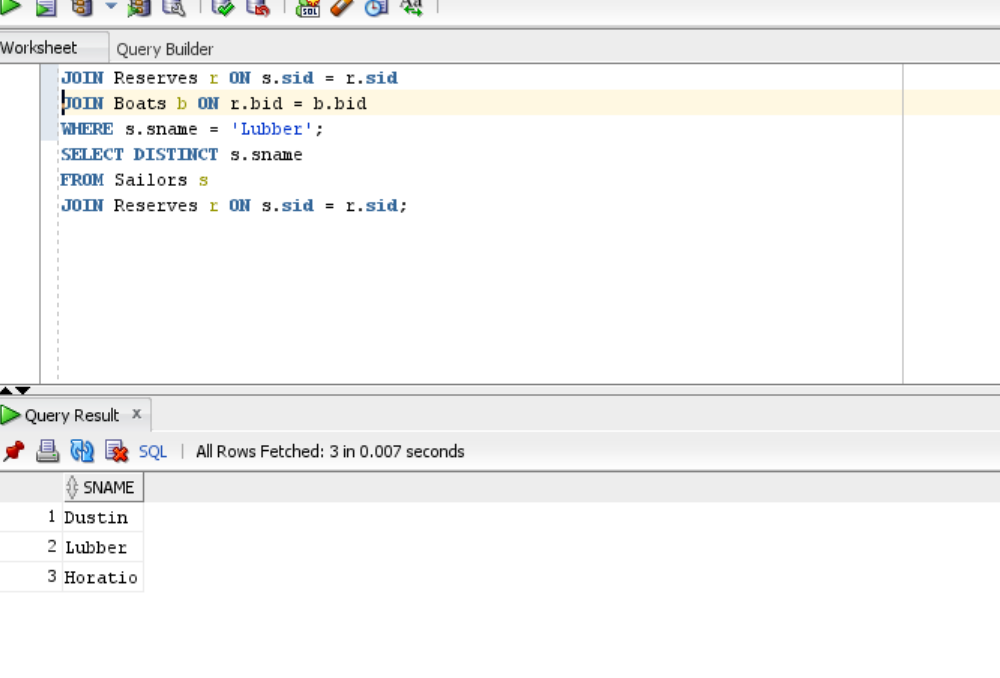
# (2b) 8. Compute increments for the ratings of persons who have sailed two different boats on the same day.
```
SELECT DISTINCT s.sname, s.rating + 1
FROM Sailors s, Reserves r1, Reserves r2
WHERE s.sid = r1.sid
AND s.sid = r2.sid
AND r1.day = r2.day
AND r1.bid < > r2.bid;
```
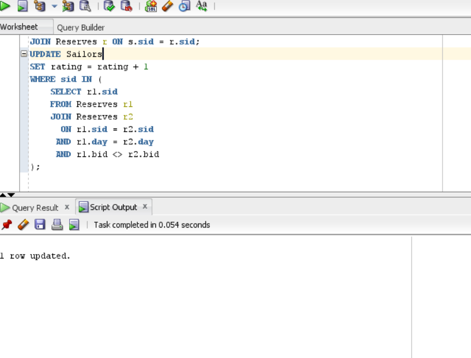
# (2b) 9.Find the ages of sailors whose name begins and ends with B and has at least three characters.
```
SELECT age
FROM Sailors
WHERE sname LIKE 'B % B'
AND LENGTH(sname) >= 3;
```
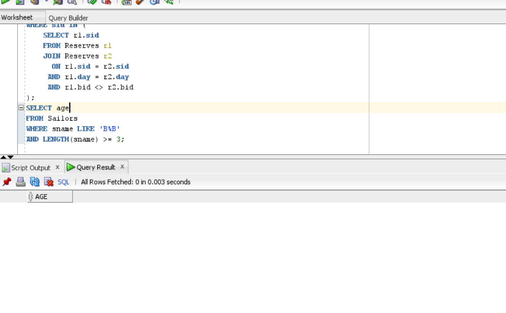
# (2b) 10.Find the names of Sailors who reserved a red boat or a green boat.
```
SELECT DISTINCT s.sname
FROM Sailors s, Reserves r, Boats b
WHERE s.sid = r.sid
AND r.bid = b.bid
AND b.color = 'red'
UNION
SELECT DISTINCT s.sname
FROM Sailors s, Reserves r, Boats b
WHERE s.sid = r.sid
AND r.bid = b.bid
AND b.color = 'green';
```
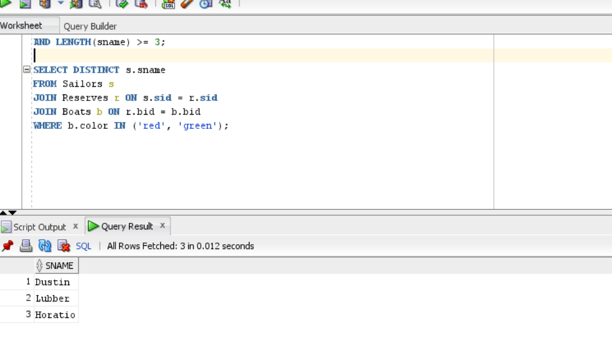
# (2b) 11.Find the names of sailors who have reserved both a red and a green boat.
```
SELECT DISTINCT s.sname
FROM Sailors s, Reserves r, Boats b
WHERE s.sid = r.sid
AND r.bid = b.bid
AND b.color = 'red'
INTERSECT
SELECT DISTINCT s.sname
FROM Sailors s, Reserves r, Boats b
WHERE s.sid = r.sid
AND r.bid = b.bid
AND b.color = 'green';
```
# (2b) 12. Find the sids of all sailors who have reserved red boats but not green boats.
```
SELECT DISTINCT s.sid
FROM Sailors s, Reserves r, Boats b
WHERE s.sid = r.sid
AND r.bid = b.bid
AND b.colour='red'
MINUS
SELECT DISTINCT s.sid
FROM Sailors s,Reserves r, Boats b
WHERE s.sid = r.sid
AND r.bid = b.bid
AND b.colour = 'green';
```
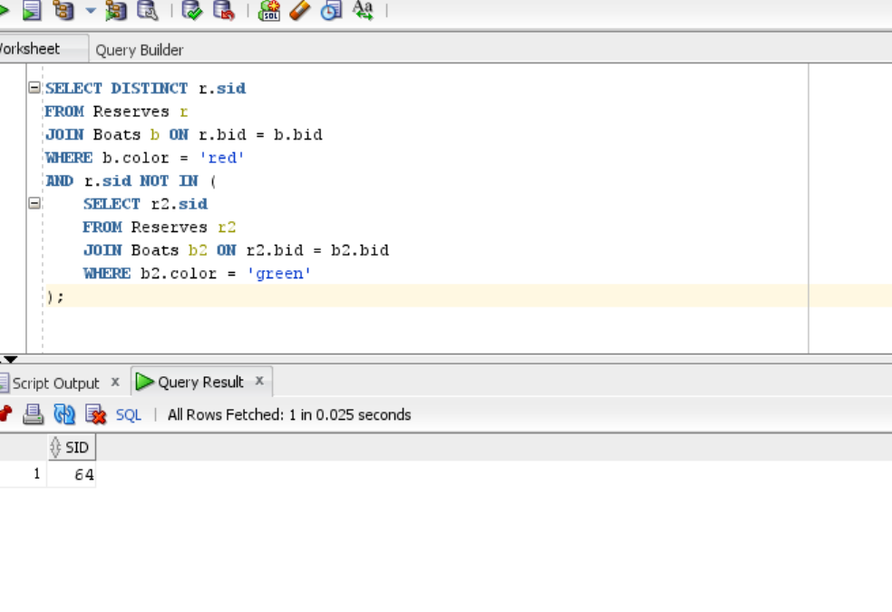
# (2b) 13. Find all sids of sailors who have a rating of 10 or have reserved boat 104.
```
SELECT sid
FROM Sailors
WHERE rating = 10
UNION
SELECT sid
FROM Reserves
WHERE bid = 104;
```
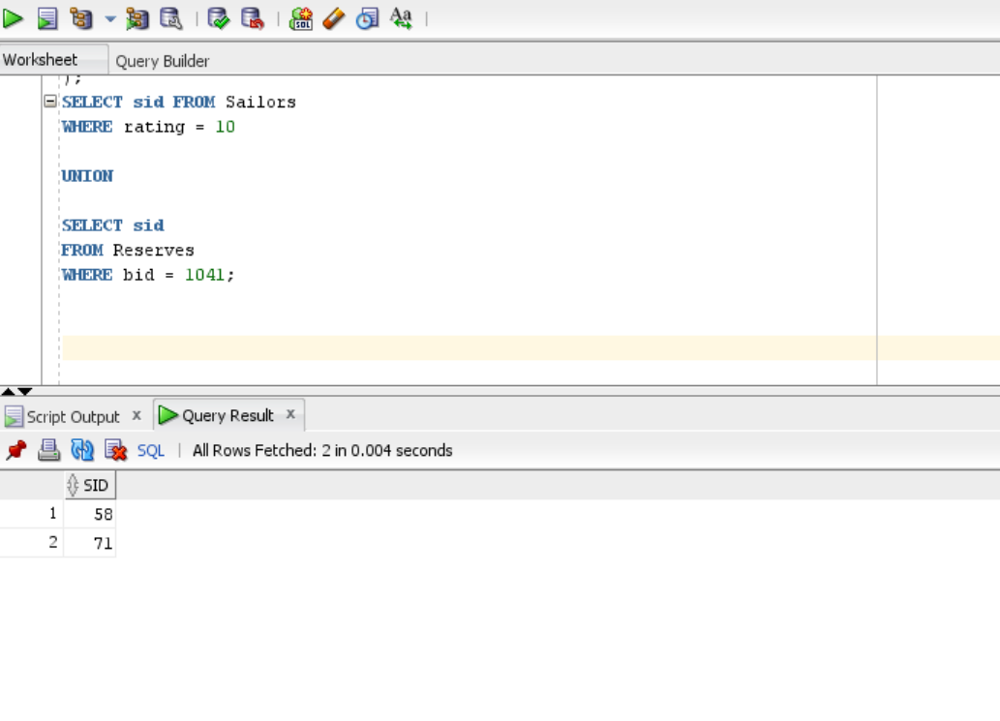
# (2b) 14. Find the names of sailors who have reserved boat number 103.
```
SELECT s.sname
FROM Sailors s
WHERE EXISTS (
    SELECT * FROM Reserves r
    WHERE r.bid = 103
    AND r.sid = s.sid
);
```
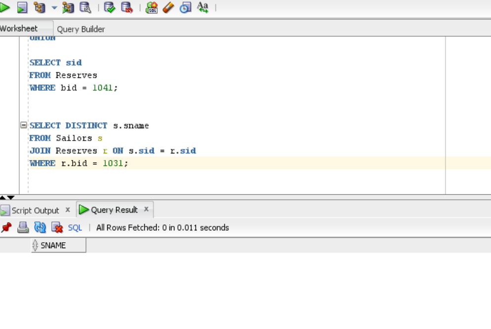
# (2b) 15. Find sailors whose rating is better than some sailor called Horatio.
```
SELECT s.sid
FROM Sailors s
WHERE s.rating > ANY (
    SELECT s2.rating
    FROM Sailors s2
    WHERE s2.sname = 'Horatio'
);
```
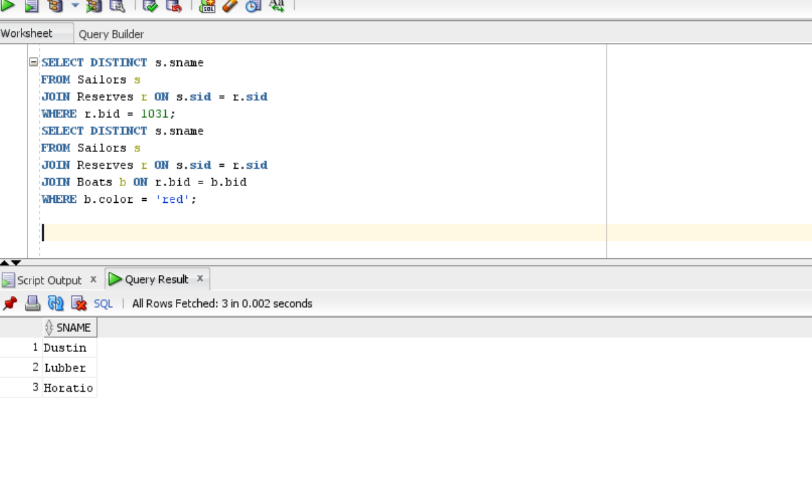
# (2b) 16. Find sailors whose rating is better than every sailor called Horatio.
```
SELECT s.sid
FROM Sailors s
WHERE s.rating > ALL (
    SELECT s2.rating
    FROM Sailors s2
    WHERE s2.sname = 'Horatio'
);
```
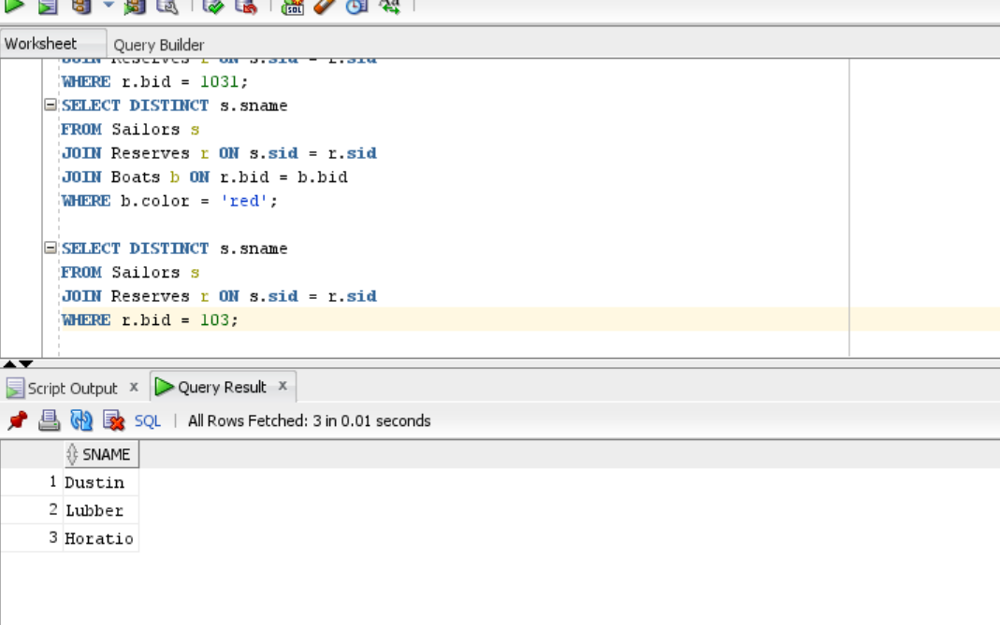
# (2b) 17. Find the sailors with the highest rating.
```
SELECT s.sid
FROM Sailors s
WHERE s.rating >= ALL (
    SELECT s2.rating
    FROM Sailors s2
);
```
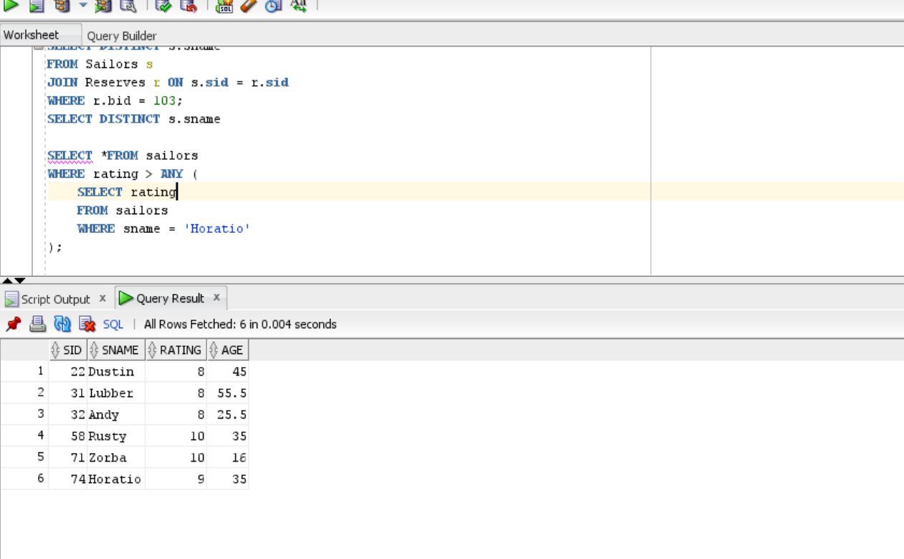
# (2b) 18. Find the names of sailors who have reserved both a red and a green boat.
```
SELECT DISTINCT s.sname
FROM Sailors s, Reserves r, Boats b
WHERE s.sid = r.sid
AND r.bid = b.bid
AND b.color = 'red'
AND s.sid IN (
    SELECT s2.sid
    FROM Sailors s2, Reserves r2, Boats b2
    WHERE s2.sid = r2.sid
    AND r2.bid = b2.bid
    AND b2.color = 'green'
);
```
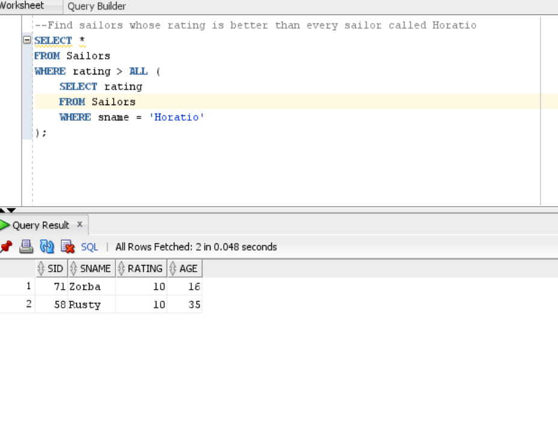
# (2b) 19. Find the sailors who have the highest rating.
```
SELECT sid
FROM Sailors
WHERE rating = (SELECT MAX(rating) FROM Sailors);
```
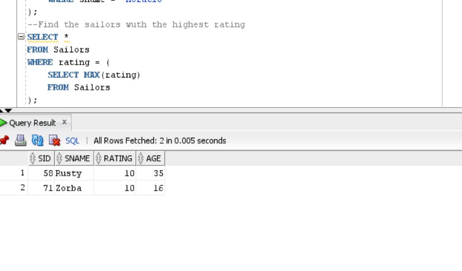
# (2b) 20. Find the names of sailors who have reserved both a red and a green boat.
```
SELECT DISTINCT s.sname
FROM Sailors s, Reserves r1, Boats b1, Reserves r2, Boats b2
WHERE s.sid = r1.sid
AND r1.bid = b1.bid
AND b1.color = 'red'
AND s.sid = r2.sid
AND r2.bid = b2.bid
AND b2.color = 'green';
```
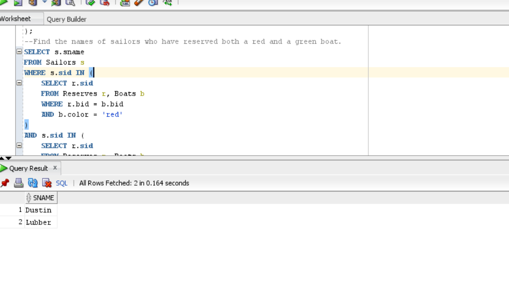
# (2b) 21. Find the names of sailors who have reserved all boats.
```
SELECT s.sname
FROM Sailors s
WHERE NOT EXISTS (
    SELECT b.bid
    FROM Boats b
    WHERE NOT EXISTS (
        SELECT r.bid
        FROM Reserves r
        WHERE r.sid = s.sid
        AND r.bid = b.bid
    )
);
```
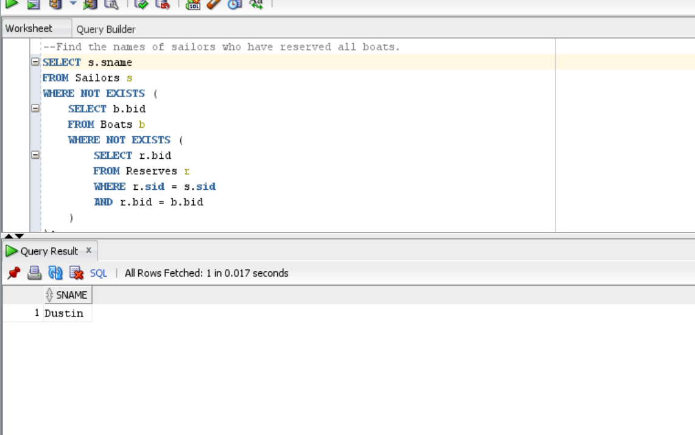
# (2b) 22. Find the average age of all sailors.
```
SELECT AVG(age)
FROM Sailors;
```
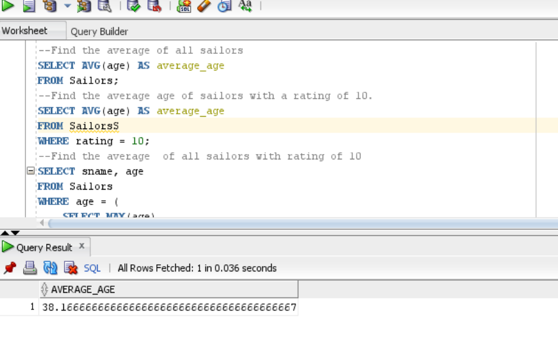
# (2b) 23.Find the average age of sailors with a rating of 10.
```
SELECT AVG(age)
FROM Sailors
WHERE rating = 10;
```
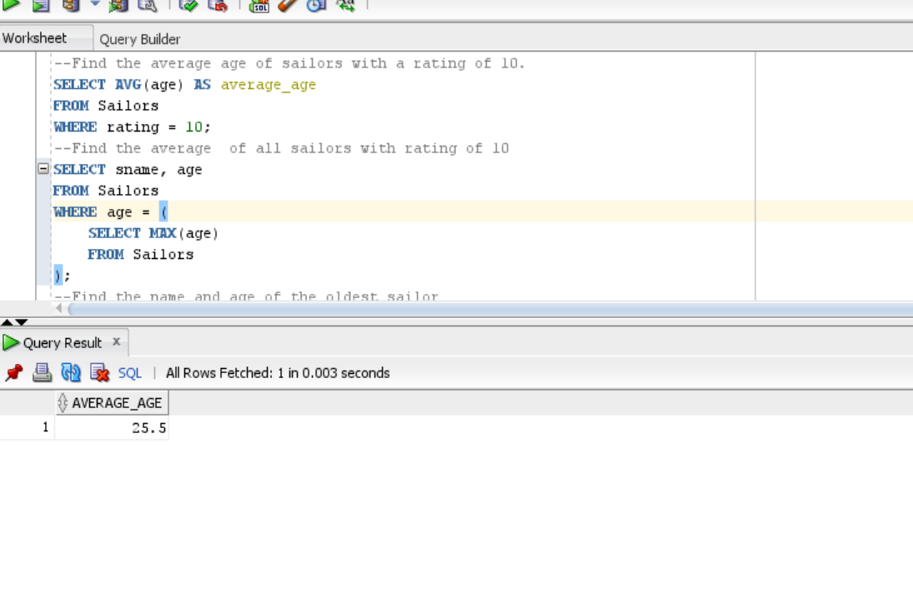
# (2b) 24. Find the name and age of the oldest sailor.
```

SELECT sname, age
FROM Sailors
WHERE age = (SELECT MAX(age) FROM Sailors);
````
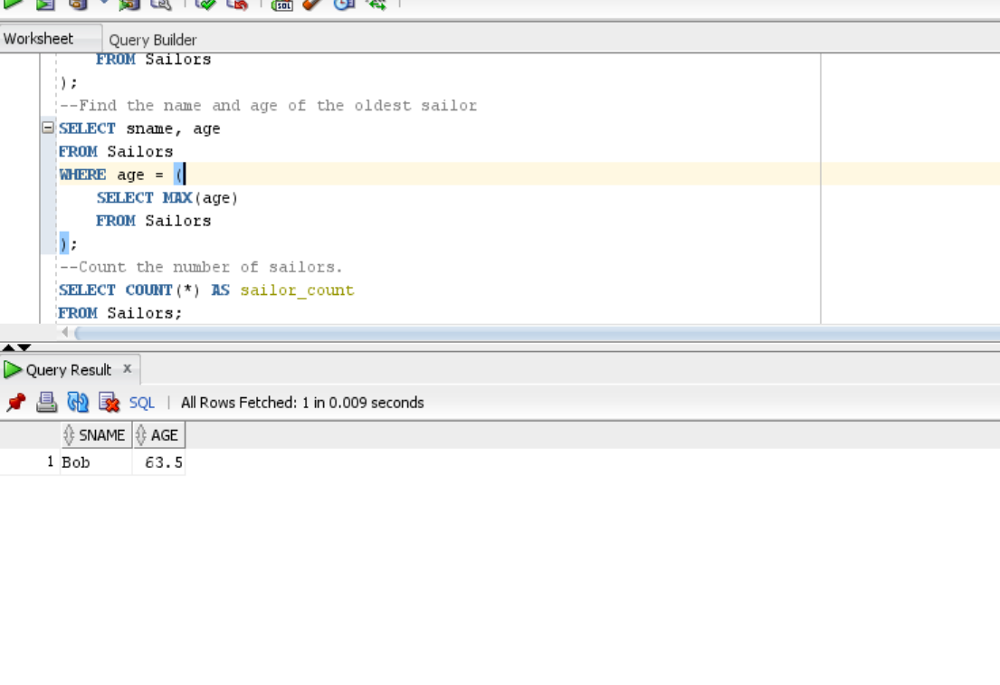
# (2b) 25. Count the number of sailors.
```
SELECT COUNT(*)
FROM Sailors;
```
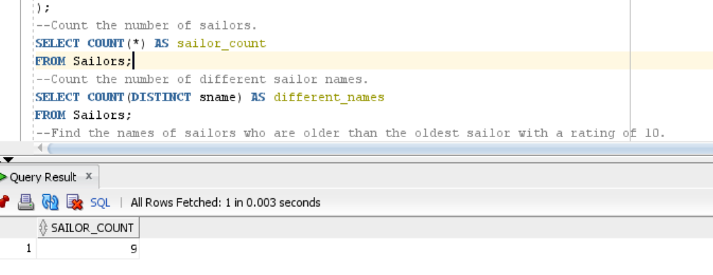
# (2b) 26. Count the number of different sailor names.
```
SELECT COUNT(DISTINCT sname)
FROM Sailors;
```
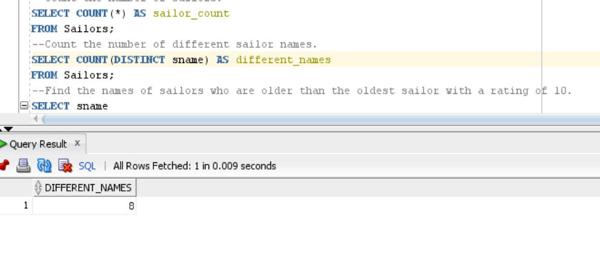
# (2b) 27. Find the names of sailors who are older than the oldest sailor with a rating of 10.
```
SELECT sname
FROM sailors
WHERE age > (
    SELECT MAX(age)
    FROM sailors
    WHERE rating = 10
);
```
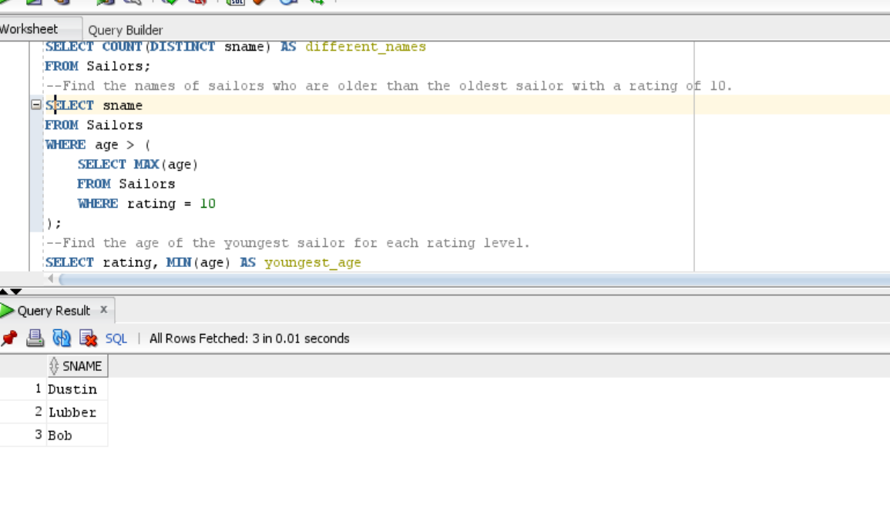
# (2b) 28. Find the age of the youngest sailor for each rating level.
```
SELECT rating, MIN(age)
FROM sailors
GROUP BY rating;
```
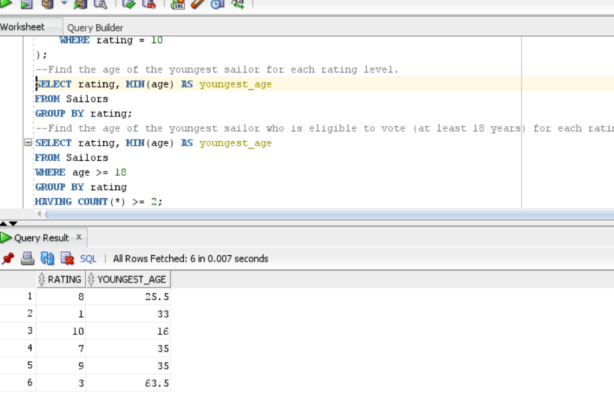
# (2b) 29. Find the age of the youngest sailor who is eligible to vote (i.e., is at least 18 years old) for each rating level with at least two such sailors.
```
SELECT rating, MIN(age)
FROM sailors
WHERE age >= 18
GROUP BY rating
HAVING COUNT(*) >= 2;
```
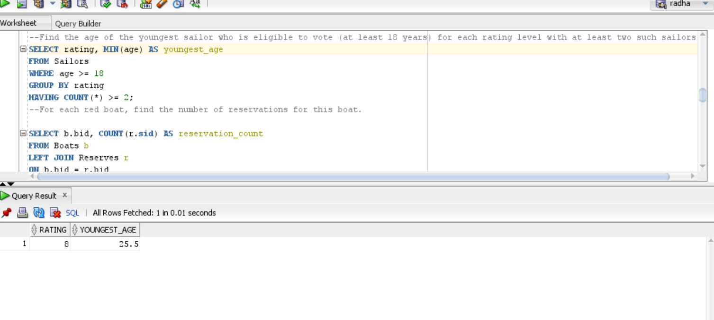
# (2b) 30. For each red boat, find the number of reservations for this boat.
```
SELECT b.bid, COUNT(r.sid)
FROM boats b, reserves r
WHERE b.bid = r.bid
AND b.color = 'red'
GROUP BY b.bid;
```
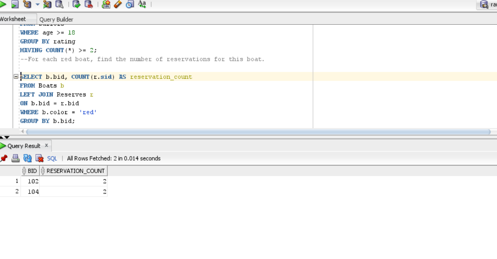
# (2b) 31. Find the average age of sailors for each rating level that has at least two sailors.
```
SELECT rating, AVG(age)
FROM sailors
GROUP BY rating
HAVING COUNT(*) >= 2;
```
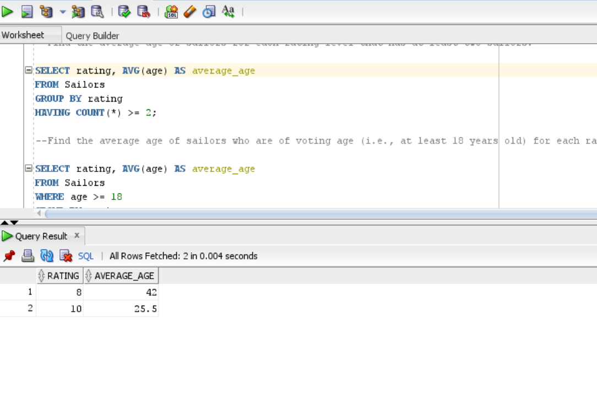
# (2b) 32. Find the average age of sailors who are of voting age (i.e., at least 18 years old) for each rating level that has at least two sailors.
```
SELECT rating, AVG(age)
FROM sailors
WHERE age >= 18
GROUP BY rating
HAVING COUNT(*) >= 2;
```
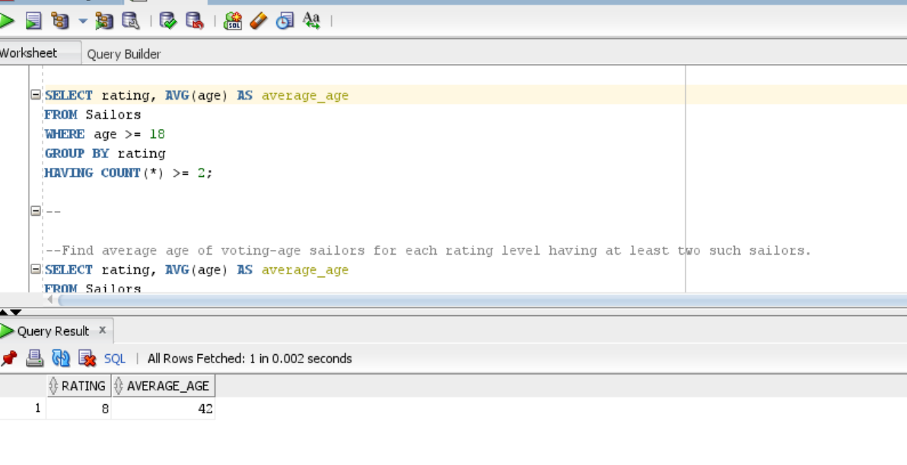
# (2b) 33. Find the average age of sailors who are of voting age (i.e., at least 18 years old) for each rating level that has at least two such sailors.
```
SELECT rating, AVG(age)
FROM sailors
WHERE age >= 18
GROUP BY rating
HAVING COUNT(*) >= 2;
```
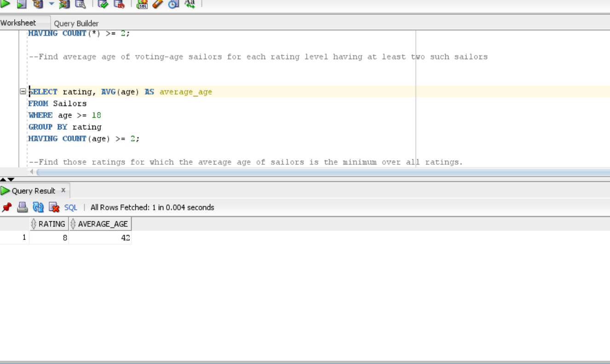
# (2b) 34. Find those ratings for which the average age of sailors is the minimum over all ratings.
```
SELECT rating
FROM sailors
GROUP BY rating
HAVING AVG(age) = (
    SELECT MIN(avg_age)
    FROM (
        SELECT rating, AVG(age) AS avg_age
        FROM sailors
        GROUP BY rating
    )
);
```
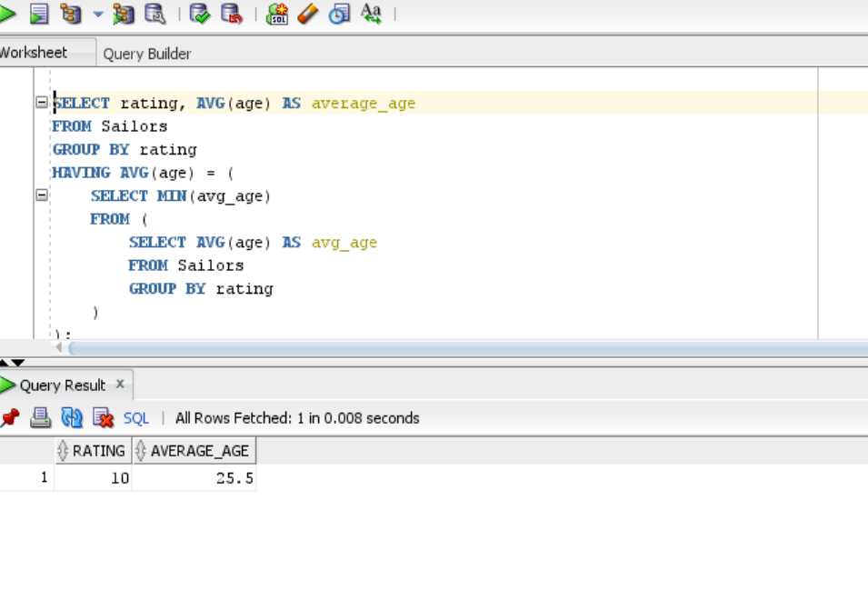
