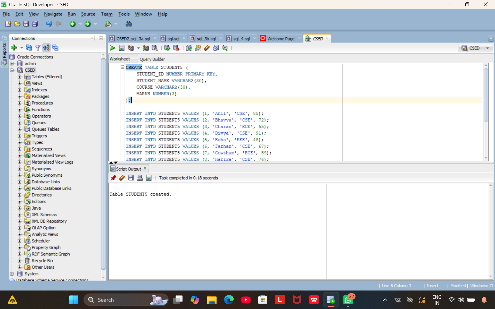
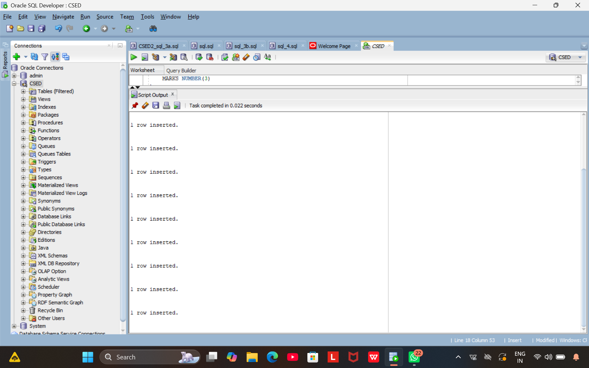
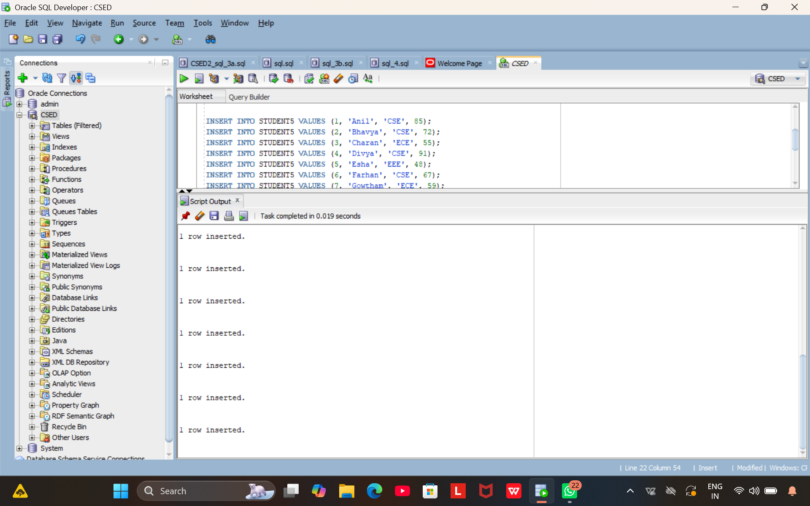
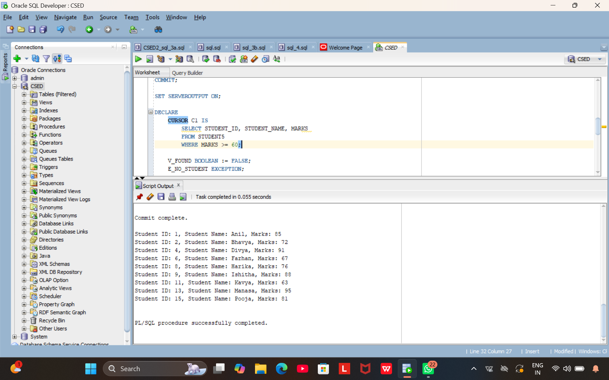
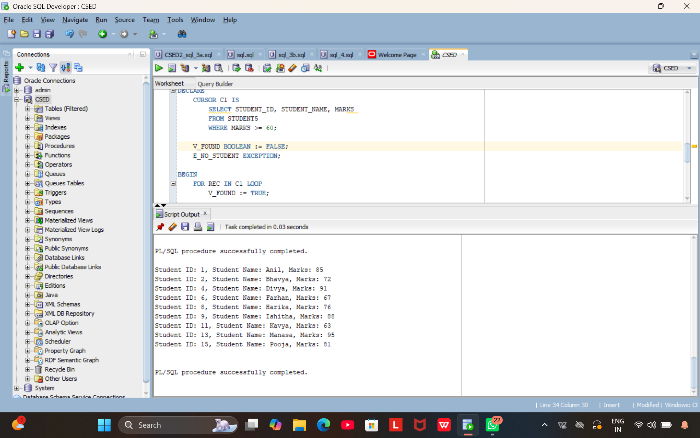
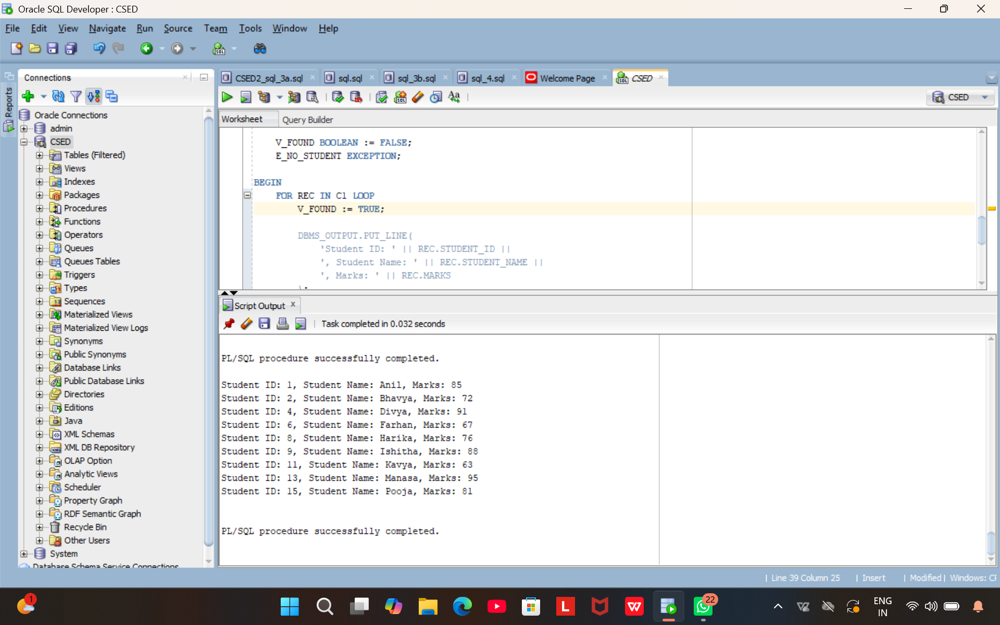
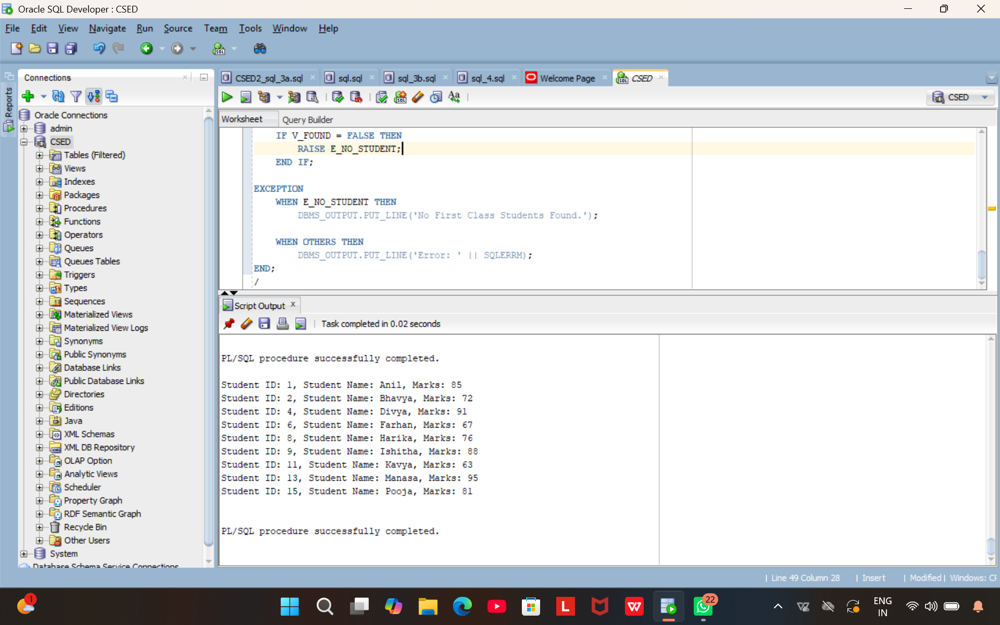
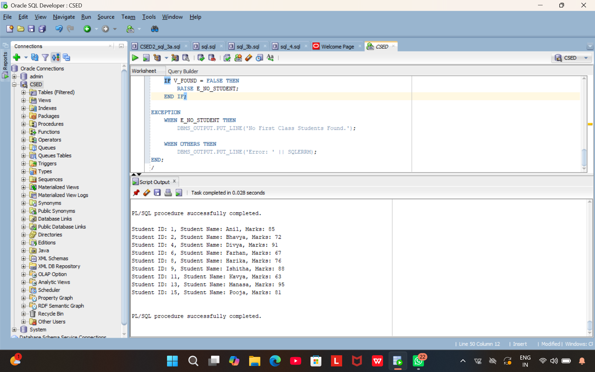
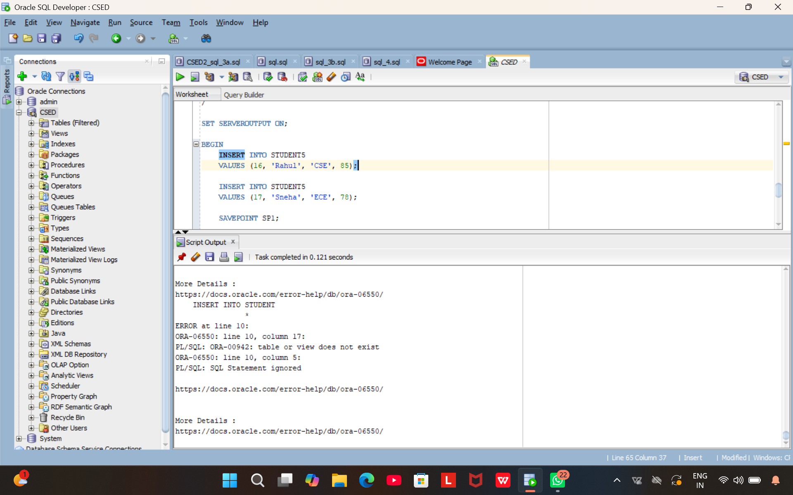
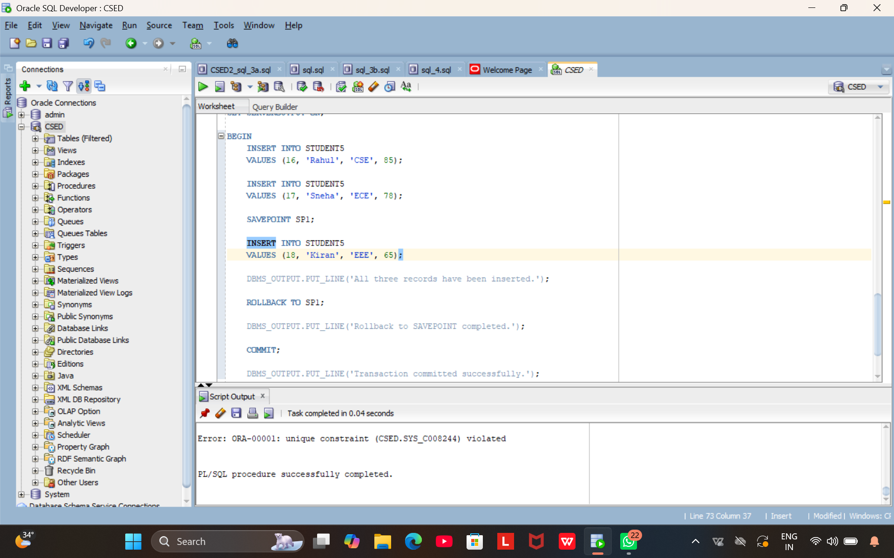

# (5a) Create student Database with attributes Student_id, Student_name, course and Marks and insert at least 15 row of data using insert statement.
```
CREATE TABLE STUDENT (
    STUDENT_ID NUMBER PRIMARY KEY,
    STUDENT_NAME VARCHAR2(30),
    COURSE VARCHAR2(30),
    MARKS NUMBER(3)
);

INSERT INTO STUDENT VALUES (1, 'Anil', 'CSE', 85);
INSERT INTO STUDENT VALUES (2, 'Bhavya', 'CSE', 72);
INSERT INTO STUDENT VALUES (3, 'Charan', 'ECE', 55);
INSERT INTO STUDENT VALUES (4, 'Divya', 'CSE', 91);
INSERT INTO STUDENT VALUES (5, 'Esha', 'EEE', 48);
INSERT INTO STUDENT VALUES (6, 'Farhan', 'CSE', 67);
INSERT INTO STUDENT VALUES (7, 'Gowtham', 'ECE', 59);
INSERT INTO STUDENT VALUES (8, 'Harika', 'CSE', 76);
INSERT INTO STUDENT VALUES (9, 'Ishitha', 'IT', 88);
INSERT INTO STUDENT VALUES (10, 'Jayanth', 'CSE', 45);
INSERT INTO STUDENT VALUES (11, 'Kavya', 'IT', 63);
INSERT INTO STUDENT VALUES (12, 'Lokesh', 'ECE', 52);
INSERT INTO STUDENT VALUES (13, 'Manasa', 'CSE', 95);
INSERT INTO STUDENT VALUES (14, 'Naveen', 'EEE', 58);
INSERT INTO STUDENT VALUES (15, 'Pooja', 'CSE', 81);

COMMIT;
```



```
SET SERVEROUTPUT ON;

DECLARE
    CURSOR C1 IS
        SELECT STUDENT_ID, STUDENT_NAME, MARKS
        FROM STUDENT
        WHERE MARKS >= 60;

    V_FOUND BOOLEAN := FALSE;
    E_NO_STUDENT EXCEPTION;

BEGIN
    FOR REC IN C1 LOOP
        V_FOUND := TRUE;

        DBMS_OUTPUT.PUT_LINE(
            'Student ID: ' || REC.STUDENT_ID ||
            ', Student Name: ' || REC.STUDENT_NAME ||
            ', Marks: ' || REC.MARKS
        );
    END LOOP;

    IF V_FOUND = FALSE THEN
        RAISE E_NO_STUDENT;
    END IF;

EXCEPTION
    WHEN E_NO_STUDENT THEN
        DBMS_OUTPUT.PUT_LINE('No First Class Students Found.');

    WHEN OTHERS THEN
        DBMS_OUTPUT.PUT_LINE('Error: ' || SQLERRM);
END;
/
```





# (5b) 5b) Insert data into student table and use COMMIT, ROLLBACK and SAVEPOINT in PL/SQL block.

```
SET SERVEROUTPUT ON;

BEGIN
    INSERT INTO STUDENT
    VALUES (16, 'Rahul', 'CSE', 85);

    INSERT INTO STUDENT
    VALUES (17, 'Sneha', 'ECE', 78);

    SAVEPOINT SP1;

    INSERT INTO STUDENT
    VALUES (18, 'Kiran', 'EEE', 65);

    DBMS_OUTPUT.PUT_LINE('All three records have been inserted.');

    ROLLBACK TO SP1;

    DBMS_OUTPUT.PUT_LINE('Rollback to SAVEPOINT completed.');

    COMMIT;

    DBMS_OUTPUT.PUT_LINE('Transaction committed successfully.');

EXCEPTION
    WHEN OTHERS THEN
        DBMS_OUTPUT.PUT_LINE('Error: ' || SQLERRM);
END;
/

SELECT * FROM STUDENT;
```



