# (7a) 1.Create table and insert sample records
```

SET SERVEROUTPUT ON;

CREATE TABLE student (
    st
udent_id NUMBER(5) PRIMARY KEY,
    student_name VARCHAR2(50),
    course VARCHAR2(30),
    marks NUMBER(5,2)
);

INSERT INTO student VALUES (101, 'Ravi', 'CSE', 85);
INSERT INTO student VALUES (102, 'Sita', 'CSE', 92);
INSERT INTO student VALUES (103, 'Kiran', 'ECE', 78);
INSERT INTO student VALUES (104, 'Anjali', 'EEE', 88);
INSERT INTO student VALUES (105, 'Rahul', 'CSE', 74);

COMMIT;
```
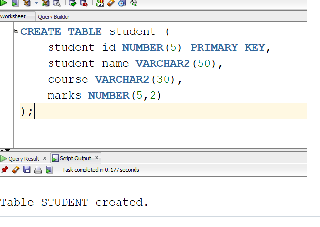
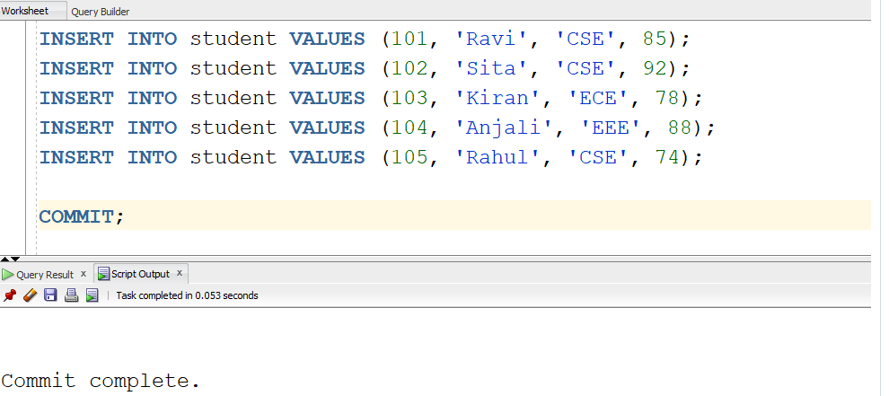
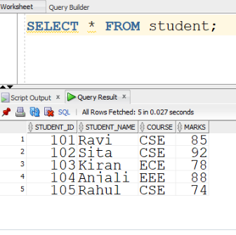

# (7a) 2.Create the stored procedure
```
CREATE OR REPLACE PROCEDURE GET_STUDENT_DETAILS (
    p_student_id   IN  student.student_id%TYPE,
    p_student_name OUT student.student_name%TYPE,
    p_marks        OUT student.marks%TYPE
)
IS
BEGIN
    -- Retrieve student details
    SELECT student_name, marks
    INTO p_student_name, p_marks
    FROM student
    WHERE student_id = p_student_id;

EXCEPTION
    WHEN NO_DATA_FOUND THEN
        p_student_name := NULL;
        p_marks := NULL;

        DBMS_OUTPUT.PUT_LINE(
            'No student found with ID: ' || p_student_id
        );

    WHEN OTHERS THEN
        DBMS_OUTPUT.PUT_LINE(
            'Error: ' || SQLERRM
        );
END;
```
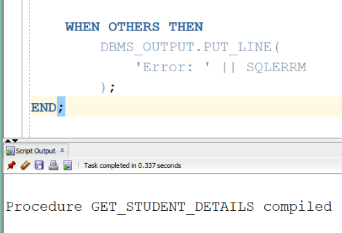
# (7a) 3.execution of procedure
```
DECLARE
    -- Variables to receive OUT parameter values
    v_student_name student.student_name%TYPE;
    v_marks        student.marks%TYPE;

BEGIN
    -- Call the procedure
    GET_STUDENT_DETAILS(
        101,
        v_student_name,
        v_marks
    );

    -- Display returned values
    IF v_student_name IS NOT NULL THEN
        DBMS_OUTPUT.PUT_LINE(
            'Student Name : ' || v_student_name
        );

        DBMS_OUTPUT.PUT_LINE(
            'Marks        : ' || v_marks
        );
    END IF;

END;

```
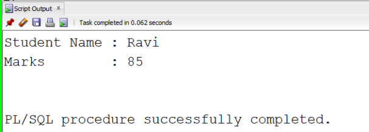
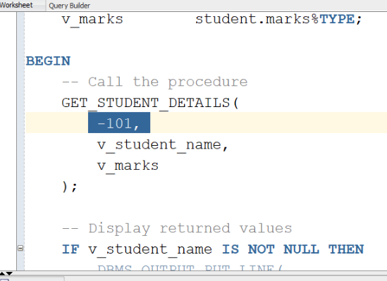
# (7a) 4.Enable server 
```

SET SERVEROUTPUT ON;
```
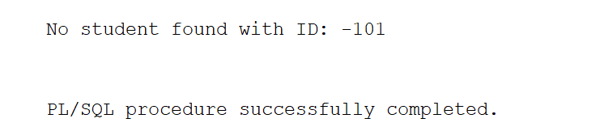
# (7a) 5.Create two bound variables
```
VARIABLE v_name VARCHAR2(50);
VARIABLE v_marks NUMBER;
```
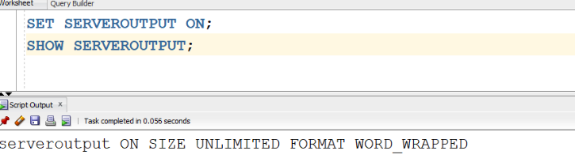

# (7a) 6. Call the procedure
```
EXEC GET_STUDENT_DETAILS(101, :v_name, :v_marks);
```
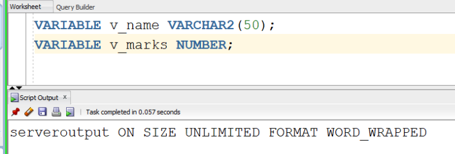
# (7a) 7.Print the two binded variables
```
PRINT v_name;
PRINT v_marks;
```
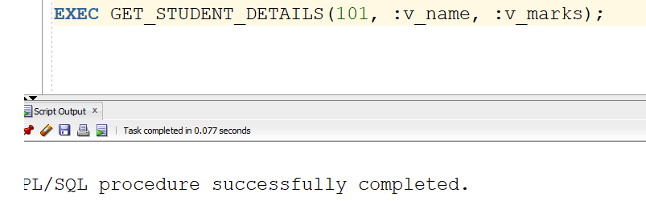
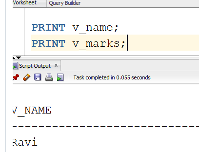
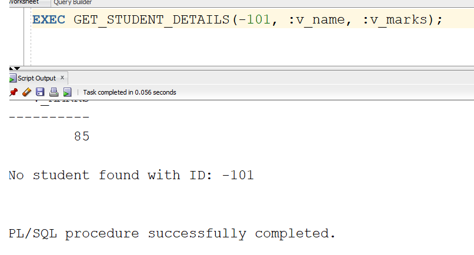


# (7b) 1.Create the employee table
```
CREATE TABLE employee (
    employee_id NUMBER(5) PRIMARY KEY,
    employee_name VARCHAR2(50),
    monthly_salary NUMBER(10,2)
);

```
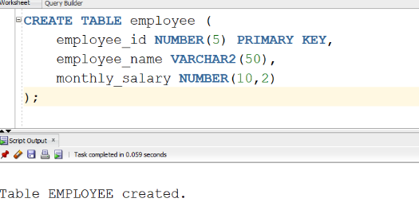

# (7b) 2.Insert sample employee records
```
INSERT INTO employee VALUES (101, 'Ravi', 25000);
INSERT INTO employee VALUES (102, 'Sita', 30000);
INSERT INTO employee VALUES (103, 'Kiran', 35000);
INSERT INTO employee VALUES (104, 'Anjali', 40000);
INSERT INTO employee VALUES (105, 'Rahul', 45000);

COMMIT;
```
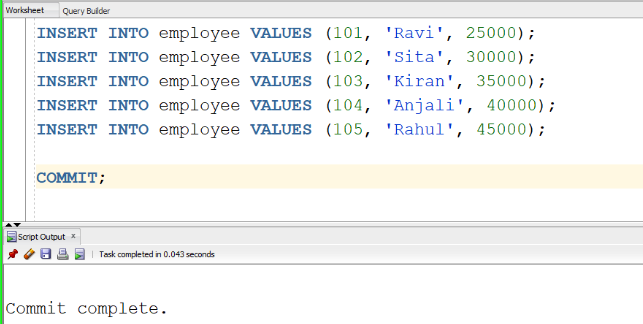

# (7b) 3.Create the stored function
```
CREATE OR REPLACE FUNCTION CALCULATE_ANNUAL_SALARY (
    p_monthly_salary IN NUMBER
)
RETURN NUMBER
IS
    v_annual_salary NUMBER;
BEGIN
    -- Calculate annual salary
    v_annual_salary := p_monthly_salary * 12;

    -- Return annual salary
    RETURN v_annual_salary;
END;
```

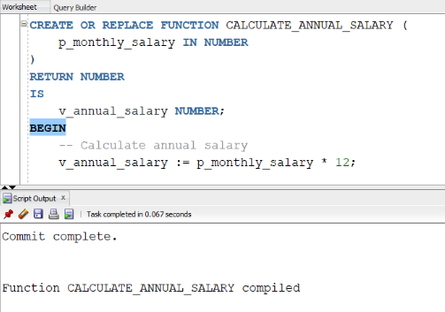
# (7b) 4.Function using SELECT
```

SELECT
    employee_id,
    employee_name,
    monthly_salary,
    CALCULATE_ANNUAL_SALARY(monthly_salary) AS annual_salary
FROM employee;
```
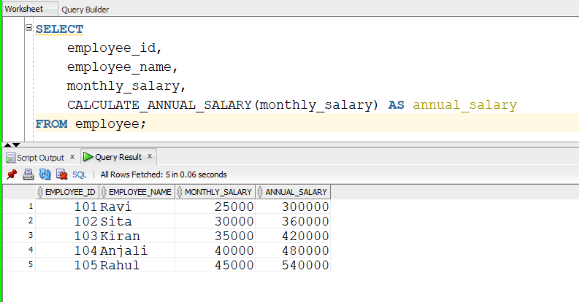

# (7b) 5.Create student table
```
CREATE TABLE student (
    student_id NUMBER(5) PRIMARY KEY,
    student_name VARCHAR2(50),
    course VARCHAR2(30),
    marks NUMBER(5,2)
);
```
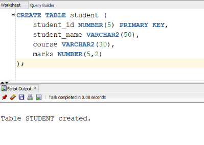
# (7b) 6.Insert sample student records
```
INSERT INTO student VALUES (101, 'Ravi',   'CSE', 85);
INSERT INTO student VALUES (102, 'Sita',   'CSE', 92);
INSERT INTO student VALUES (103, 'Kiran',  'ECE', 78);
INSERT INTO student VALUES (104, 'Anjali', 'EEE', 88);
INSERT INTO student VALUES (105, 'Rahul',  'CSE', 74);
INSERT INTO student VALUES (106, 'Priya',  'ECE', 95);
INSERT INTO student VALUES (107, 'Arun',   'IT',  81);
INSERT INTO student VALUES (108, 'Sneha',  'CSE', 89);
INSERT INTO student VALUES (109, 'Vijay',  'EEE', 68);
INSERT INTO student VALUES (110, 'Divya',  'IT',  91);
INSERT INTO student VALUES (111, 'Manoj',  'ECE', 76);
INSERT INTO student VALUES (112, 'Kavya',  'CSE', 84);
INSERT INTO student VALUES (113, 'Ramesh', 'IT',  72);
INSERT INTO student VALUES (114, 'Swathi', 'EEE', 87);
INSERT INTO student VALUES (115, 'Ajay',   'ECE', 93);

COMMIT;
```
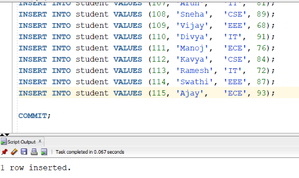
# (7b) 7.Displaying of student information
```

SELECT * FROM student;
```
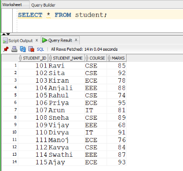
# (7b) 8.Stored functin creation
```

CREATE OR REPLACE FUNCTION COUNT_STUDENTS (
    p_course IN VARCHAR2
)
RETURN NUMBER
IS
    v_total_students NUMBER;
BEGIN
    -- Count students belonging to the given course
    SELECT COUNT(*)
    INTO v_total_students
    FROM student
    WHERE course = p_course;

    -- Return the count
    RETURN v_total_students;
END;
```
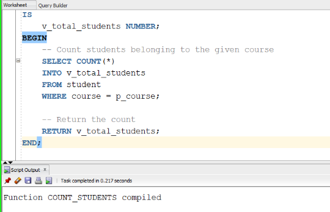

# (7b) 9.Invoke the function using select
```
SELECT
    'CSE' AS course,
    COUNT_STUDENTS('CSE') AS total_students
FROM dual;
```
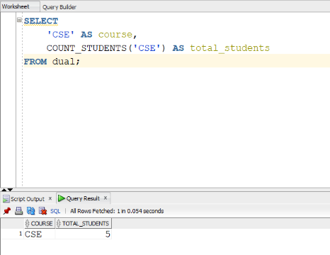
# (7b) 10.Test other cases
```
SELECT
    'ECE' AS course,
    COUNT_STUDENTS('ECE') AS total_students
FROM dual;
```
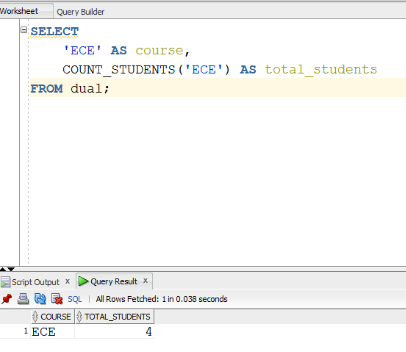

# (7b) 11.Display count for all courses
```

SELECT
    course,
    COUNT_STUDENTS(course) AS total_students
FROM (
    SELECT DISTINCT course
    FROM student
);
```
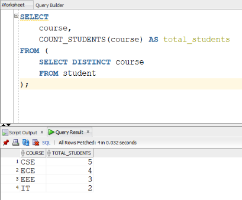

# (7b) 12.Create the student table
```

CREATE TABLE student (
    student_id NUMBER(5) PRIMARY KEY,
    student_name VARCHAR2(50),
    marks NUMBER(5,2)
);
```
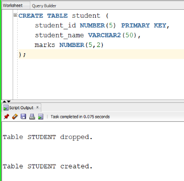

# (7b) 13.Student table insertion
```
INSERT INTO student VALUES (101, 'Ravi',   85);
INSERT INTO student VALUES (102, 'Sita',   72);
INSERT INTO student VALUES (103, 'Kiran',  55);
INSERT INTO student VALUES (104, 'Anjali', 45);
INSERT INTO student VALUES (105, 'Rahul',  30);
INSERT INTO student VALUES (106, 'Priya',  91);
INSERT INTO student VALUES (107, 'Arun',   68);
INSERT INTO student VALUES (108, 'Sneha',  58);

COMMIT;
```
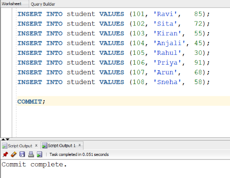

# (7b) 14.Display student table
```
SELECT * FROM student;
```
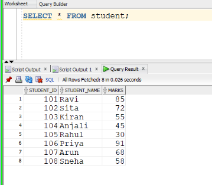

# (7b) 15.Create the stored function GET_GRADE
```
CREATE OR REPLACE FUNCTION GET_GRADE (
    p_marks IN NUMBER
)
RETURN VARCHAR2
IS
    v_grade VARCHAR2(20);
BEGIN

    -- Determine grade based on marks
    IF p_marks >= 75 THEN
        v_grade := 'Distinction';

    ELSIF p_marks >= 60 THEN
        v_grade := 'First Class';

    ELSIF p_marks >= 50 THEN
        v_grade := 'Second Class';

    ELSIF p_marks >= 35 THEN
        v_grade := 'Pass';

    ELSE
        v_grade := 'Fail';
    END IF;

    -- Return the calculated grade
    RETURN v_grade;

END;
/

```
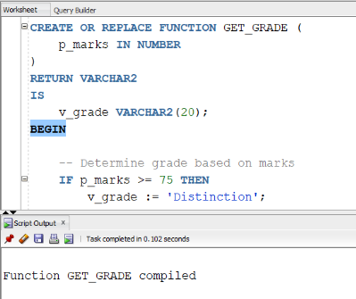

# (7b) 16.Invoke the function using SELECT
```
SELECT
    student_name,
    marks,
    GET_GRADE(marks) AS grade
FROM student;
```
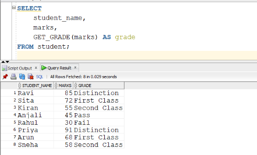
